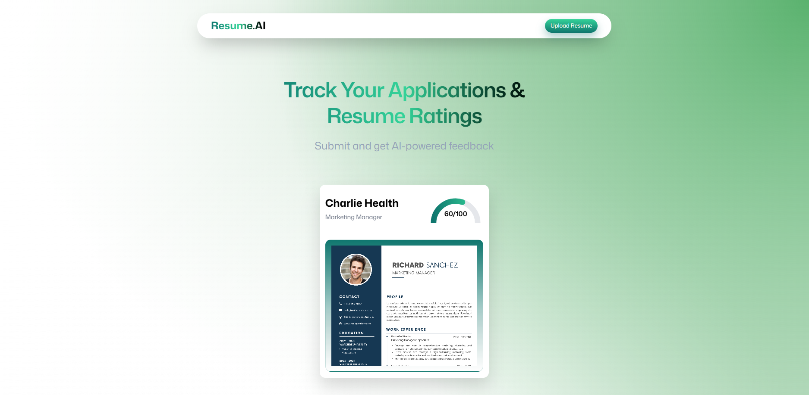
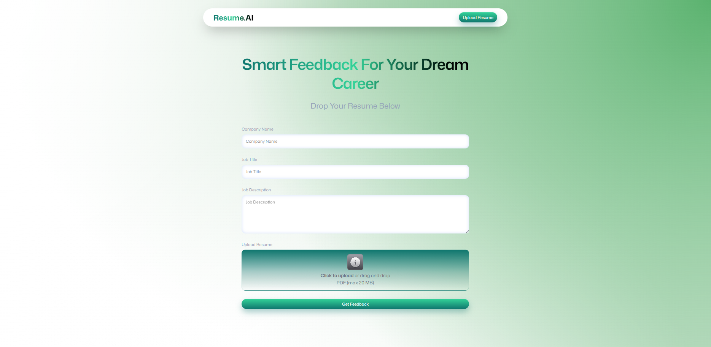
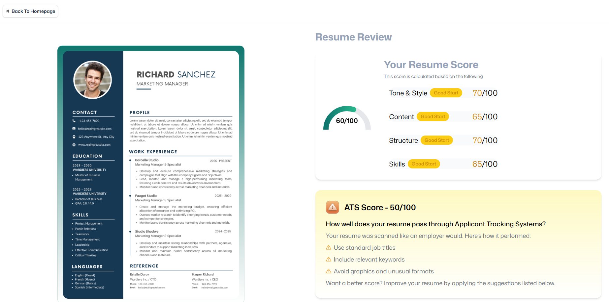
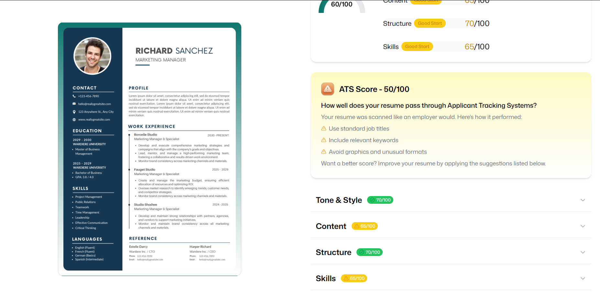

# Resume Analyzer 🧠📄

An AI-powered Resume Analyzer web application that helps users evaluate resumes by extracting key information, analyzing skills, and providing structured insights to improve resume quality and job relevance.

Built with a modern React stack and designed with usability and clarity in mind.

---

## 🚀 Features

- Upload resumes (PDF/DOCX)
- Resume text extraction
- Skill and keyword analysis
- Clean, responsive UI
- Fast client-side navigation
- Ready to integrate with ML / NLP backend

---

## 🛠 Tech Stack

- React
- React Router
- TypeScript
- Tailwind CSS
- Vite

---

## 📸 Screenshots

### Home Page

### Resume Upload

### Analysis Results

