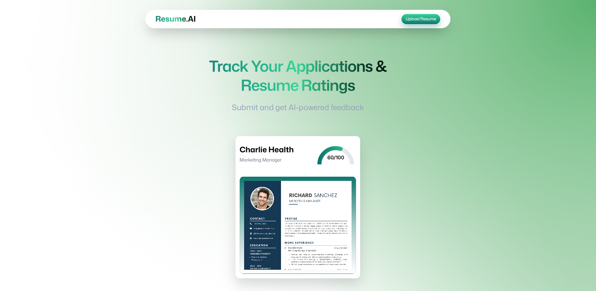
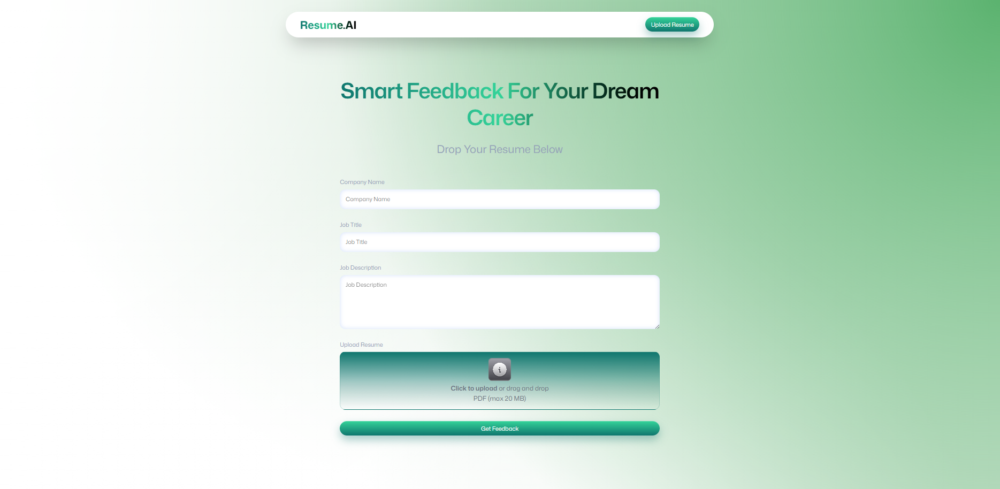
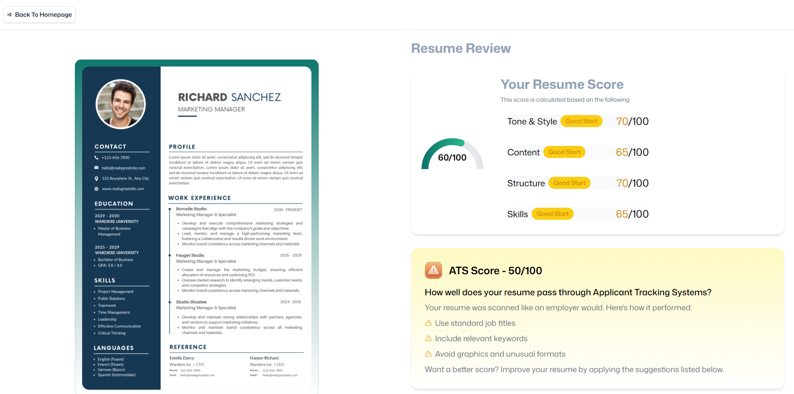
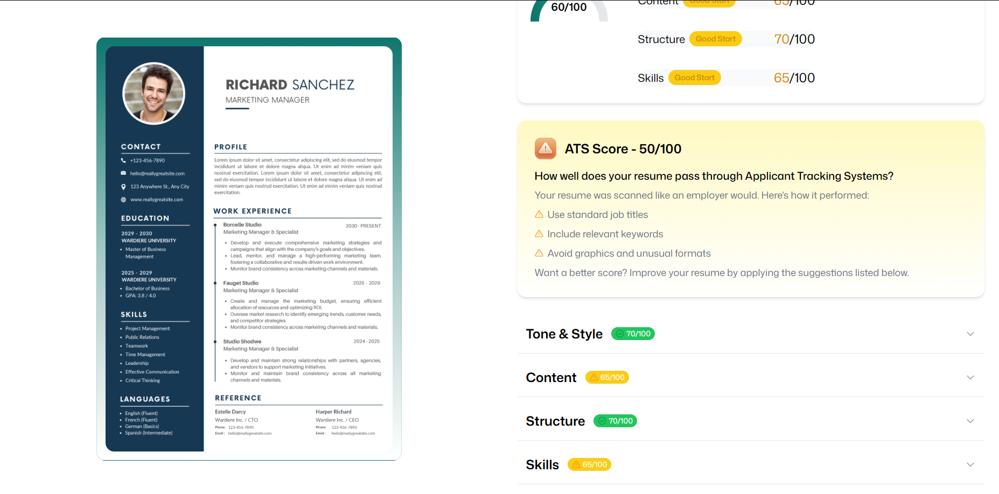

# 📄 Resume.AI — AI-Powered Resume Analyzer

> Upload your resume. Paste a job description. Know exactly where you stand.

Resume.AI analyzes how well your resume aligns with a job description and gives you structured, actionable feedback — no vague advice, no generic tips. Built with a modern React stack and designed to be fast, clean, and genuinely useful.

---

## 🛠️ Technologies

| Layer | Tech |
|---|---|
| Frontend | React, TypeScript |
| Styling | Tailwind CSS |
| Routing | React Router |
| Bundler | Vite |
| AI | Built-in (no API key needed) |

---

## ✨ Features

- **Resume upload** — supports PDF and DOCX formats
- **Text extraction** — pulls content directly from your uploaded file
- **Skill & keyword analysis** — identifies key skills and matches them against the job description
- **Structured feedback** — clear, readable insights on what to improve
- **Job relevance scoring** — see how aligned your resume is at a glance
- **Clean responsive UI** — fast client-side navigation with a minimal, focused design

---

## 👤 What Users Can Do

1. Upload their resume (PDF or DOCX)
2. Paste in a job description they're targeting
3. Hit analyze and get structured AI feedback instantly
4. Review key insights — what's working, what's missing, what to fix
5. Use the feedback to improve their resume before applying

---

## 🧠 My Process

1. **Identified the problem** — most resume feedback tools are generic. I wanted something that actually compares your resume to a specific job, not just checks formatting.
2. **Planned the architecture** — chose React + TypeScript for a scalable, type-safe frontend, and Vite for fast development.
3. **Built the upload flow** — implemented file upload handling for both PDF and DOCX with text extraction on the client side.
4. **Designed the analysis output** — structured the AI feedback into readable sections so users know exactly what to act on.
5. **Styled with Tailwind** — kept the UI clean and responsive, prioritizing readability over decoration.
6. **Integrated routing** — used React Router to create a smooth multi-page experience without full page reloads.

---

## 📚 What I Learned

- **React + TypeScript** — how to build a real application with typed components and props
- **Vite** — modern frontend tooling and how it speeds up the development workflow
- **Tailwind CSS** — utility-first styling and how to build clean UIs fast
- **File handling in the browser** — reading and extracting text from PDF and DOCX uploads
- **Structuring AI output** — how to prompt and format AI responses into something genuinely useful for users
- **Component architecture** — breaking a feature-rich app into clean, reusable React components

---

## 🔮 How It Could Be Improved

- [ ] Job description matching with a relevance score out of 100
- [ ] Save and export analysis results as PDF
- [ ] User accounts with resume history
- [ ] Support for more file types (TXT, Google Docs link)
- [ ] Improved AI analysis accuracy with more targeted prompting
- [ ] Side-by-side view of resume vs job description highlights

---

## ▶️ How to Run Locally

### Prerequisites
- Node.js installed

### Steps

```bash
# 1. Clone the repo
git clone https://github.com/nadijaranawaka/Resume.AI.git
cd Resume.AI

# 2. Install dependencies
npm install

# 3. Start the development server
npm run dev

# 4. Open in your browser
# Visit http://localhost:5173
```

> No API key required — the AI is built into the app.

---

## 🎬 Demo

### Home Page


### Resume Upload


### Analysis Results



---

*Built by [Nadija Ranawaka](https://github.com/nadijaranawaka) — 1st year AI & Data Science undergrad, Sri Lanka 🇱🇰*
